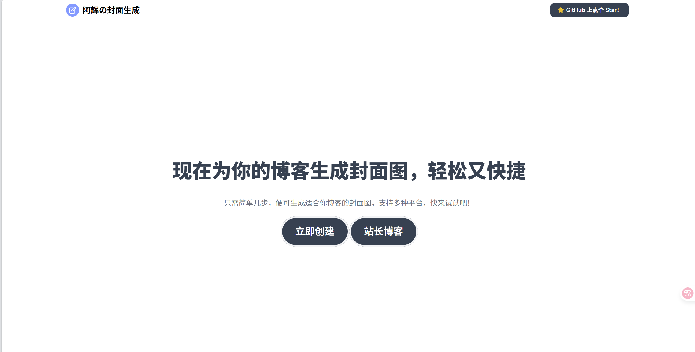
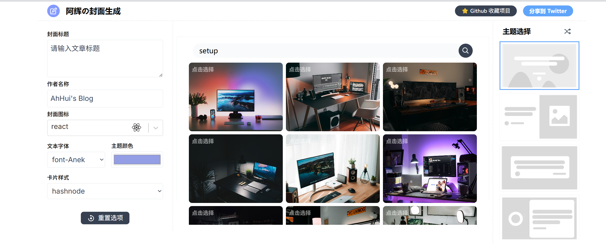

<p>
<a href="https://github.com/wojackop/cover-creator"></a>
<a href="https://github.com/wojackop/cover-creator"></a>
<a href="https://lbesson.mit-license.org"></a>
</p>

<a href="./README.md">简体中文</a> | <a href="./README_EN.md">English</a>

## 简介
**为你的博客文章生成封面图片从未如此简单。**这是一款开源工具，旨在帮助你快速、轻松地为博客或社交媒体创建美观的封面图。





## ✨ 特性

- ⚡ **极速体验**：使用 Vite + React 18，开发服务器启动飞快。
- 🌈 **多样主题**：7 种不同主题，多种字体可选。
- ✨ **图片集成**：内置 Unsplash 图片搜索。
- 🌠 **丰富图标**：支持 100+ 开发者图标，可上传自定义图标。
- 💾 **平台适配**：根据 Hashnode、Dev 等博客平台调整封面尺寸。

## 👩‍💻 本地部署

本项目已从 `create-react-app` 成功迁移到现代化的 **Vite + React 18 + pnpm** 技术栈。

### 克隆与安装

```bash
# 克隆仓库
git clone https://github.com/willow-god/CoverView.git
cd CoverView

# 使用 pnpm 安装依赖 (推荐)
pnpm install

# 或使用 npm
npm install
```

### 启动开发服务器

```bash
# 启动开发环境
pnpm dev
# 或 npm run dev
```

服务将启动在 `http://localhost:3000`。

### 构建生产版本

```bash
# 构建用于生产的静态资源
pnpm build
# 或 npm run build
```

构建产物将输出到 `dist/` 目录。

## 🙏 致谢与贡献

本项目由以下贡献者共同维护：

1. **Rutik Wankhade** ([@rutikwankhade ](https://github.com/rutikwankhade)) - 原始项目创建者。
2. **Willow God** ([@willow-god ](https://github.com/willow-god)) - 负责项目现代化迁移、中文本地化和样式美化。

同时，感谢以下开源项目为本项目提供了支持：

- [dom-to-image ](https://github.com/tsayen/dom-to-image)- 用于将 DOM 元素导出为图片。
- [Hero Patterns ](https://www.heropatterns.com/)- 提供精美的背景图案。
- [Devicons ](https://github.com/devicons/devicon)- 提供丰富的开发者图标。

## 🤝 贡献指南

欢迎提交 Pull Request。对于重大变更，请先创建 Issue 讨论。

1. Fork 仓库 ([https://github.com/rutikwankhade/CoverView/fork ](https://github.com/rutikwankhade/CoverView/fork))
2. 创建特性分支 (`git checkout -b feature/your-feature`)
3. 提交更改 (`git commit -m 'Add some feature'`)
4. 推送到分支 (`git push origin feature/your-feature`)
5. 创建 Pull Request
