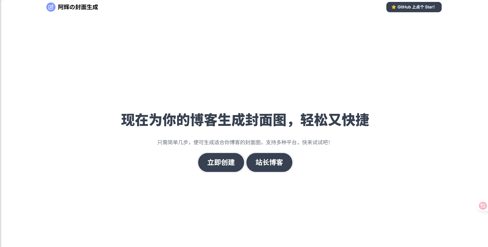
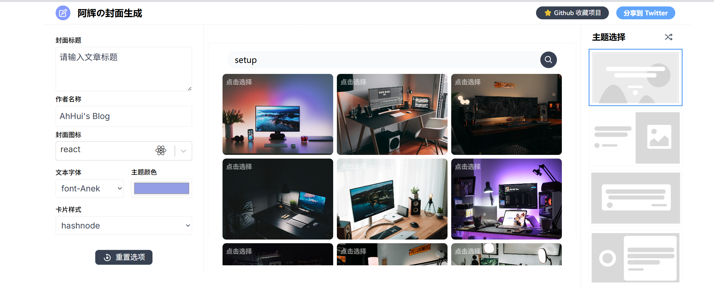

<p>
  <a href="https://github.com/wojackop/cover-creator"></a>
  <a href="https://github.com/wojackop/cover-creator"></a>
  <a href="https://lbesson.mit-license.org"></a>
</p>
## 📝 Introduction

**Creating cover images for your blogs has never been easier.** This is an open-source tool designed to help you quickly and effortlessly create beautiful cover images for your blog posts or social media.





---

## ✨ Features

- ⚡ **Blazing Fast**: Powered by Vite + React 18 for an incredibly fast development experience.
- 🌈 **Multiple Themes**: Choose from 7 different themes and a variety of fonts.
- ✨ **Image Integration**: Built-in Unsplash image search.
- 🌠 **Rich Icons**: Supports 100+ developer icons and allows uploading custom icons.
- 💾 **Platform Adaptation**: Adjusts cover size for different blogging platforms like Hashnode and Dev.

---

## 👩‍💻 Local Deployment

This project has been successfully migrated from `create-react-app` to the modern **Vite + React 18 + pnpm** tech stack.

### 📥 Clone and Install

```bash
# Clone the repository
git clone https://github.com/willow-god/CoverView.git
cd CoverView

# Install dependencies with pnpm (recommended)
pnpm install

# Or with npm
npm install
```

### ▶️ Start the Development Server

```bash
# Start the development environment
pnpm dev
# or npm run dev
```

The server will start at `http://localhost:3000`.

### 🏗️ Build for Production

```bash
# Build static assets for production
pnpm build
# or npm run build
```

The build output will be placed in the `dist/` directory.

## 🙏 Acknowledgments & Contributors

This project is maintained by:

1. **Rutik Wankhade** ([@rutikwankhade ](https://github.com/rutikwankhade)) - Original creator.
2. **Willow God** ([@willow-god ](https://github.com/willow-god)) - Responsible for modernizing the tech stack, Chinese localization, and style improvements.

We also extend our gratitude to the following open-source projects for their support:

- [dom-to-image ](https://github.com/tsayen/dom-to-image)- Used for exporting DOM elements as images.
- [Hero Patterns ](https://www.heropatterns.com/)- Provides beautiful background patterns.
- [Devicons ](https://github.com/devicons/devicon)- Provides a rich collection of developer icons.

## 🤝 Contribution Guidelines

Pull requests are welcome. For major changes, please open an issue first to discuss your proposed changes.

1. Fork the repository ([https://github.com/rutikwankhade/CoverView/fork ](https://github.com/rutikwankhade/CoverView/fork))
2. Create a feature branch (`git checkout -b feature/your-feature`)
3. Commit your changes (`git commit -m 'Add some feature'`)
4. Push to the branch (`git push origin feature/your-feature`)
5. Create a Pull Request